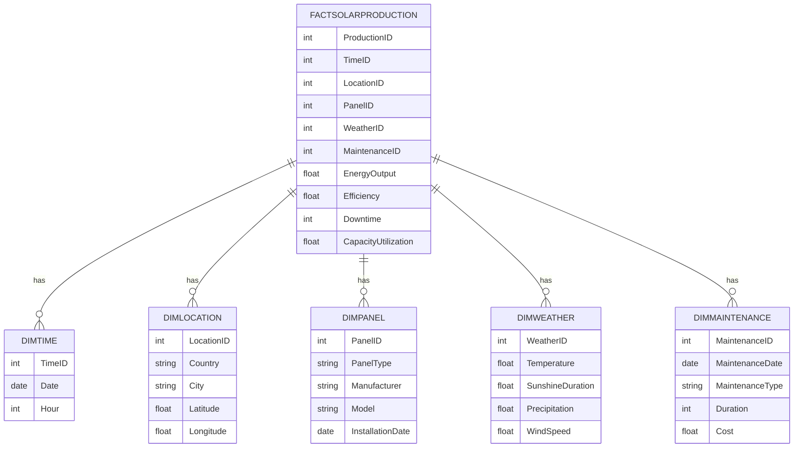

## Standards

Data Modeling: IEC 61970 for Energy Management System Integration. Data Models: Logical Semantic Data Model with fact and dimension tables to be deployed to Azure Synapse Analytics dedicated pool.

## LogicalDataModel

The logical data model will consist of a star schema design, centralizing around the FactSolarProduction table, which will be linked to various dimension tables such as DimTime, DimLocation, DimPanel, DimWeather, and DimMaintenance.

## FactTables

- {'TableName': 'FactSolarProduction', 'Fields': [{'FieldName': 'ProductionID', 'DataType': 'INT', 'IsPrimaryKey': True, 'IsForeignKey': False}, {'FieldName': 'TimeID', 'DataType': 'INT', 'IsPrimaryKey': False, 'IsForeignKey': True}, {'FieldName': 'LocationID', 'DataType': 'INT', 'IsPrimaryKey': False, 'IsForeignKey': True}, {'FieldName': 'PanelID', 'DataType': 'INT', 'IsPrimaryKey': False, 'IsForeignKey': True}, {'FieldName': 'WeatherID', 'DataType': 'INT', 'IsPrimaryKey': False, 'IsForeignKey': True}, {'FieldName': 'MaintenanceID', 'DataType': 'INT', 'IsPrimaryKey': False, 'IsForeignKey': True}, {'FieldName': 'EnergyOutput', 'DataType': 'FLOAT', 'IsPrimaryKey': False, 'IsForeignKey': False}, {'FieldName': 'Efficiency', 'DataType': 'FLOAT', 'IsPrimaryKey': False, 'IsForeignKey': False}, {'FieldName': 'Downtime', 'DataType': 'INT', 'IsPrimaryKey': False, 'IsForeignKey': False}, {'FieldName': 'CapacityUtilization', 'DataType': 'FLOAT', 'IsPrimaryKey': False, 'IsForeignKey': False}], 'Description': 'This table records the KPIs related to solar panel production, including energy output, efficiency, downtime, and capacity utilization, linked to time, location, panel type, weather conditions, and maintenance activities.'}

## DimensionTables

- {'TableName': 'DimTime', 'Fields': [{'FieldName': 'TimeID', 'DataType': 'INT', 'IsPrimaryKey': True, 'IsForeignKey': False}, {'FieldName': 'Date', 'DataType': 'DATE', 'IsPrimaryKey': False, 'IsForeignKey': False}, {'FieldName': 'Hour', 'DataType': 'INT', 'IsPrimaryKey': False, 'IsForeignKey': False}], 'Description': 'This dimension table stores time-related data, which includes the date and hour for when the production data was recorded.'}
- {'TableName': 'DimLocation', 'Fields': [{'FieldName': 'LocationID', 'DataType': 'INT', 'IsPrimaryKey': True, 'IsForeignKey': False}, {'FieldName': 'Country', 'DataType': 'VARCHAR', 'IsPrimaryKey': False, 'IsForeignKey': False}, {'FieldName': 'City', 'DataType': 'VARCHAR', 'IsPrimaryKey': False, 'IsForeignKey': False}, {'FieldName': 'Latitude', 'DataType': 'FLOAT', 'IsPrimaryKey': False, 'IsForeignKey': False}, {'FieldName': 'Longitude', 'DataType': 'FLOAT', 'IsPrimaryKey': False, 'IsForeignKey': False}], 'Description': 'This dimension table stores location data where solar panels are installed, including country, city, and geographical coordinates.'}
- {'TableName': 'DimPanel', 'Fields': [{'FieldName': 'PanelID', 'DataType': 'INT', 'IsPrimaryKey': True, 'IsForeignKey': False}, {'FieldName': 'PanelType', 'DataType': 'VARCHAR', 'IsPrimaryKey': False, 'IsForeignKey': False}, {'FieldName': 'Manufacturer', 'DataType': 'VARCHAR', 'IsPrimaryKey': False, 'IsForeignKey': False}, {'FieldName': 'Model', 'DataType': 'VARCHAR', 'IsPrimaryKey': False, 'IsForeignKey': False}, {'FieldName': 'InstallationDate', 'DataType': 'DATE', 'IsPrimaryKey': False, 'IsForeignKey': False}], 'Description': 'This dimension table stores information about the solar panels, including type, manufacturer, model, and installation date.'}
- {'TableName': 'DimWeather', 'Fields': [{'FieldName': 'WeatherID', 'DataType': 'INT', 'IsPrimaryKey': True, 'IsForeignKey': False}, {'FieldName': 'Temperature', 'DataType': 'FLOAT', 'IsPrimaryKey': False, 'IsForeignKey': False}, {'FieldName': 'SunshineDuration', 'DataType': 'FLOAT', 'IsPrimaryKey': False, 'IsForeignKey': False}, {'FieldName': 'Precipitation', 'DataType': 'FLOAT', 'IsPrimaryKey': False, 'IsForeignKey': False}, {'FieldName': 'WindSpeed', 'DataType': 'FLOAT', 'IsPrimaryKey': False, 'IsForeignKey': False}], 'Description': 'This dimension table stores weather conditions that may affect solar panel performance, including temperature, sunshine duration, precipitation, and wind speed.'}
- {'TableName': 'DimMaintenance', 'Fields': [{'FieldName': 'MaintenanceID', 'DataType': 'INT', 'IsPrimaryKey': True, 'IsForeignKey': False}, {'FieldName': 'MaintenanceDate', 'DataType': 'DATE', 'IsPrimaryKey': False, 'IsForeignKey': False}, {'FieldName': 'MaintenanceType', 'DataType': 'VARCHAR', 'IsPrimaryKey': False, 'IsForeignKey': False}, {'FieldName': 'Duration', 'DataType': 'INT', 'IsPrimaryKey': False, 'IsForeignKey': False}, {'FieldName': 'Cost', 'DataType': 'FLOAT', 'IsPrimaryKey': False, 'IsForeignKey': False}], 'Description': 'This dimension table stores maintenance records for solar panels, including the date, type, duration, and cost of maintenance activities.'}

## ERDiagram

            

## KPIs

- {'KPIName': 'Energy Output', 'Description': 'Total energy produced by solar panels in a given time frame.', 'Calculation': 'SUM(EnergyOutput) from FactSolarProduction'}
- {'KPIName': 'Efficiency', 'Description': 'Ratio of energy output to the solar energy received by the panels.', 'Calculation': 'AVG(Efficiency) from FactSolarProduction'}
- {'KPIName': 'Downtime', 'Description': 'Total time when the solar panels were not operational due to maintenance or other issues.', 'Calculation': 'SUM(Downtime) from FactSolarProduction'}
- {'KPIName': 'Capacity Utilization', 'Description': "Percentage of the solar panel's production capacity that is actually being used.", 'Calculation': 'AVG(CapacityUtilization) from FactSolarProduction'}

## DataIntegration

- 1. Data from the company's internal database will be ingested into Azure Synapse Analytics.
- 2. Weather data will be integrated using an API and stored in the DimWeather table.
- 3. Maintenance records will be imported from the asset management system into the DimMaintenance table.
- 4. Data transformations will be applied to calculate the KPIs as per the business logic defined.

## AnythingUnlear

The document is clear on the requirements for the data model. However, further clarification may be needed on the specific business logic for KPI calculations and any data privacy concerns that may arise.

