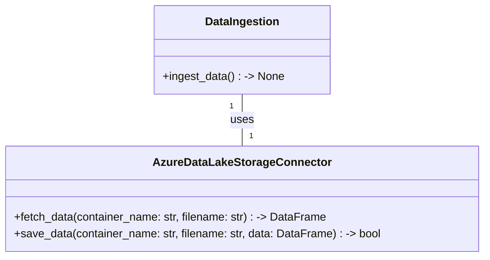
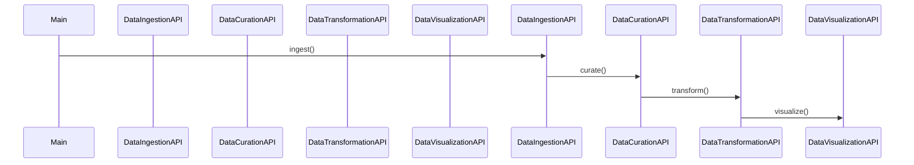

## HighLevelSystemDesign

            The solution architecture is designed to leverage a microservices architecture pattern, where each microservice is implemented using Python. These microservices will be orchestrated using Apache Airflow to deliver an ETL Data Pipeline that is capable of handling the ingestion, curation, transformation, and visualization of solar panel sensor data. The architecture is scalable and will be deployed to Azure Synapse Analytics spark pool or Azure Kubernetes, with the option to also deploy locally if required. 
            The microservices are named DataIngestion, DataCuration, DataTransformation, DataVisualization, and Orchestration.
            

## DataIngestion

The DataIngestion microservice does the following: 
            It includes a Data Adaptor sub-component that implements several data adaptors for sources such as APIs, databases, local folders, and Azure Data Lake folders. 
            The adaptors are configurable using a config yaml file that includes parameters like ProjectName, DataSource, SourcePath, SourceName, DataType, UserName, and Password.
            Each data source is configurable to connect to the respective source type.
            The data will be ingested in its original format from the configured data source and ingested into an Azure Data Lake common data store folder called "raw" for the current date. 
            A folder will be created under the "raw" folder for the current date. If the DataType is not 'csv', a data-converter implementation will convert the data into a csv file.
            

## DataCuration

The DataCuration microservice does the following: 
            The raw data will be loaded from the Azure Data Lake common data store folder called "raw" as a pandas dataframe. 
            Duplicates will be removed, and nulls will be replaced with a placeholder value. 
            The source data will be mapped to target data (column by column), and the curated data will be stored in the Azure Data Lake common data store folder called "curated" as a parquet table. 
            The table will be appended after each pipeline run and data ingestion.
            

## DataTransformation

The DataTransformation microservice does the following: 
            The curated data will be loaded from the Azure Data Lake common data store folder called "curated" as a pandas dataframe. 
            The logical data model will be used to transform the curated data into the star schema format with fact and dimension tables.
            The KPIs defined in the requirements will be calculated using this data model.
            The transformed data tables will be stored in the Azure Data Lake common data store folder called "conformed". 
            The transformed data table will append records if the table exists from a previous run.
            

## DataVisualization

The DataVisualization microservice does the following: 
            The conformed data will be loaded from the Azure Data Lake common data store folder called "conformed" as a pandas dataframe. 
            Graphics such as line graphs, bar charts, and heat maps will be created using Plotly, based on the KPIs and visualizations outlined in the requirements document.
            Interactive elements will be included to allow users to drill down into specific data points.
            

## Orchestration

The orchestration is the main starter file that does the following: 
            It ensures that Apache Airflow creates a DAG for a data pipeline orchestrating the REST APIs from each microservice in sequence to be scheduled to run per day at a specific hour.
            It captures exceptions in the data pipeline to log the error and exit.
            

## ClassDiagrams

## ProgramFlow

